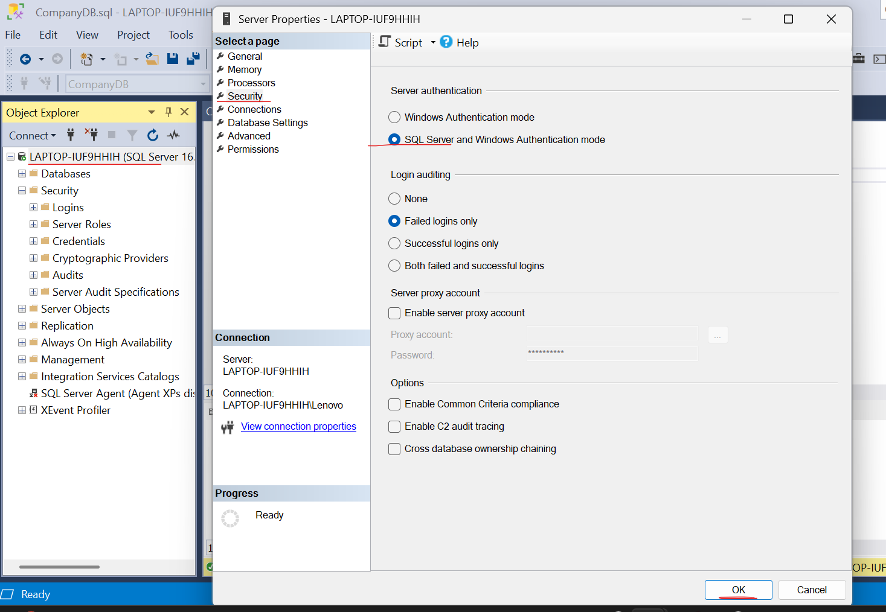
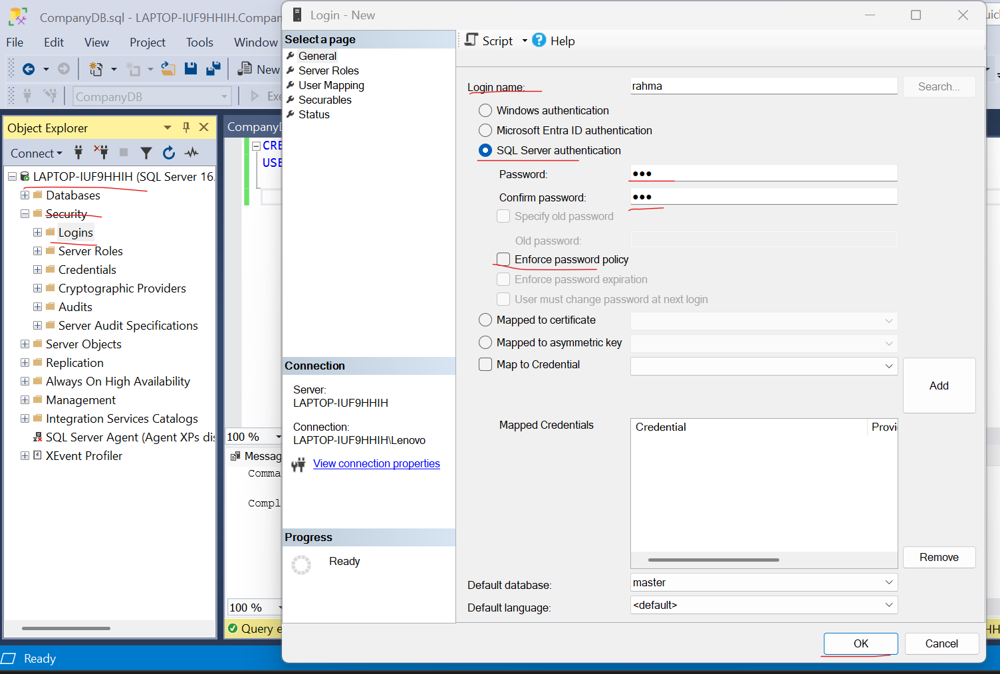
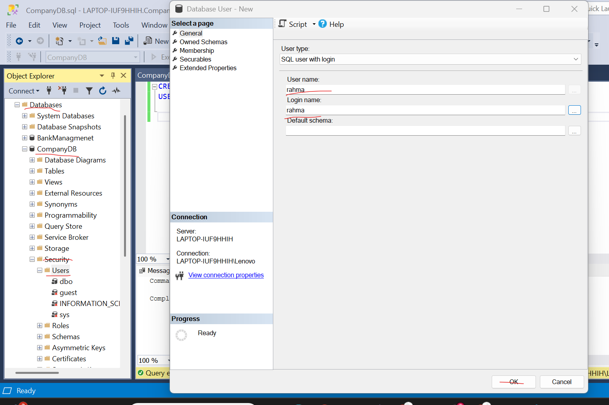
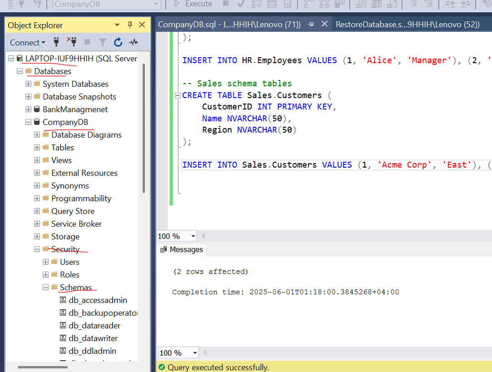
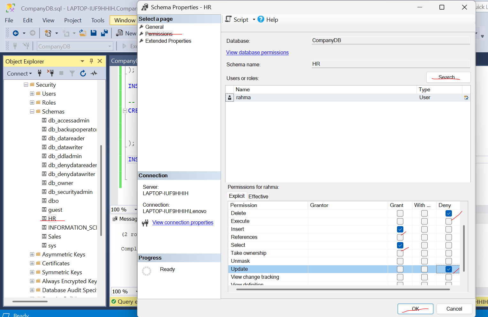
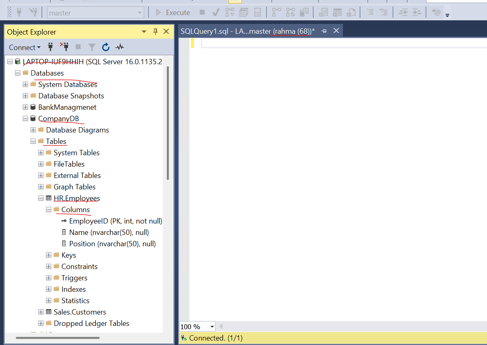
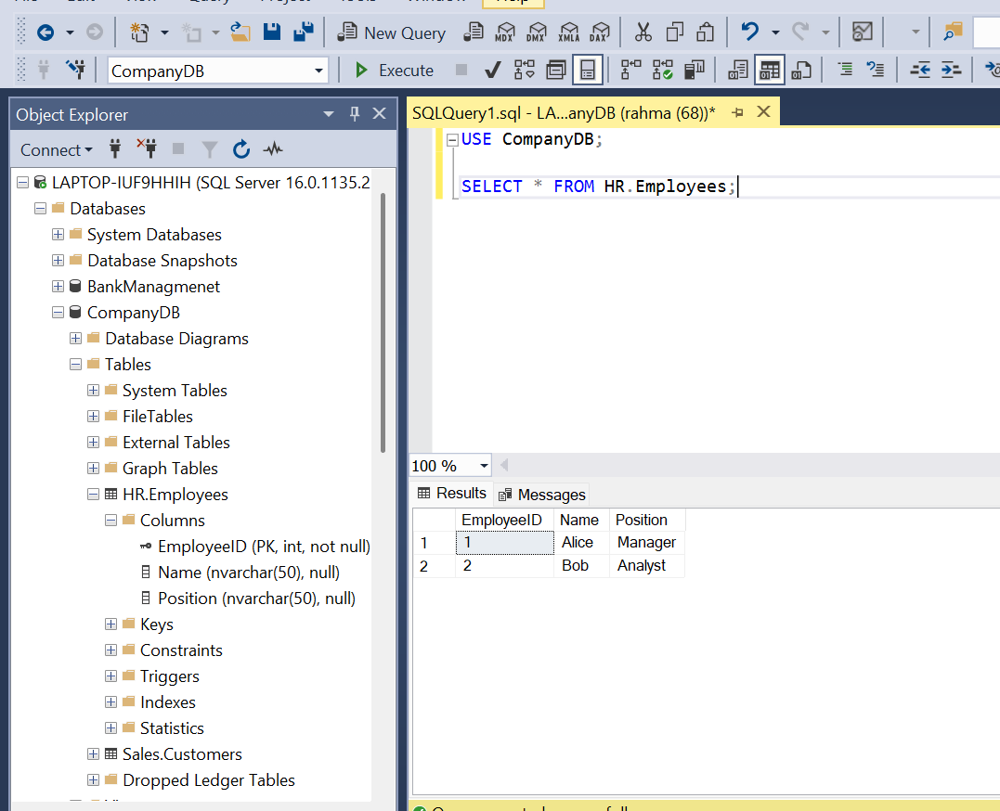
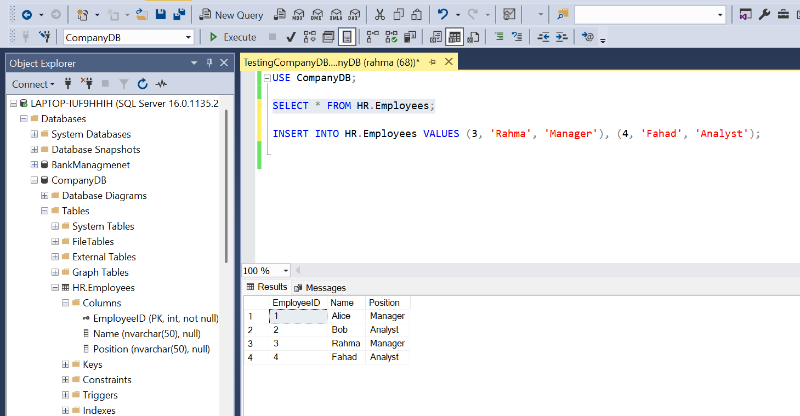
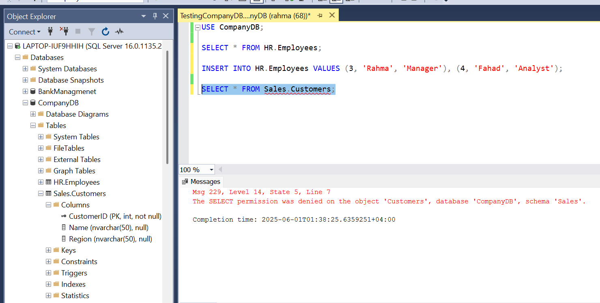

# **Understanding SQL Security Levels and Real-World Risks**

## **1. What are SQL Security Levels?**

**1.1. Server-level login:**

A server-level login is a security principal that allows a user or application to connect to the SQL Server instance. It is created at the SQL Server instance level and is required before a user can access any databases within the server.

**Types of Server-Level Logins:**

1. SQL Server Authentication Logins
   - Stored in SQL Server
   - Username and password managed by SQL Server
2. Windows Authentication Logins
   - Uses Windows accounts or groups
   - More secure and manageable in domain environments

**1.2. Database-level user:**

A database-level user is a security principal that allows access to objects within a specific database in a SQL Server instance. It is created inside a particular database and is usually mapped to a server-level login.

**Types of Database Users:**

1. Mapped to Logins
   - Regular users connected to server logins.
2. Contained Users
   - Not tied to server-level logins. Useful in contained databases.
3. Application Roles
   - Used by applications to run with specific permissions.

**1.3. Schema-level permissions:**

A Schema-level permissions control what actions a user can perform on all objects within a schema.

**Common Schema-Level Permissions**
|Permission |Description                                   |
|-----------|----------------------------------------------|
|SELECT     |Read data from all tables/views in the schema |
|INSERT     |Add data to tables in the schema              |
|UPDATE     |Modify data in tables in the schema           |
|DELETE     |Remove data from tables in the schema         |
|ALTER      |Modify the schema definition                  |
|EXECUTE    |Run stored procedures/functions in the schema |

**Why Use Schema-Level Permissions?**

1. Simplifies management –> grant once, apply to many objects.
2. Consistency –> ensures all objects in the schema follow the same access rules.
3. Security –> control access based on organizational boundaries (e.g., HR vs. Finance).

**1.4. Object-level permissions:**

A Object-level permissions control what a user can do with specific objects inside a database, such as:

- Tables
- Views
- Stored Procedures
- Functions
- Sequences
- Synonyms

**Why Use Object-Level Permissions?**

1. Precision -> Give a user access to only the data they need.
2. Security –> Prevent unauthorized access or modification.
3. Flexibility –> Tailor access on a case-by-case basis.

**~~SQL Server Security Hierarchy (Context Recap):~~**

1. **Server-Level**/ Who can access the server (e.g., logins).
2. **Database-Level**/ Who can access a database (e.g., users).
3. **Schema-Level**/ Group permissions for collections of objects.
4. **Object-Level**/ Fine-grained permissions on individual objects.

## **Benefits of Applying Security Level**

1. **Improved Data Security**
   - Ensures that only authorized users can access sensitive data.
   - Prevents accidental or malicious exposure, modification, or deletion of data.
   - Allows for granular control over who can see or change what.

2. **Least Privilege Principle**
   - Users only get the minimum permissions necessary to do their job.
   - Reduces the risk of errors and unauthorized actions.
   - Enforces role-based access control effectively.

3. **Clear Role Separation**
   - Server admins, database developers, and end-users can have clearly defined roles.
   - Prevents overlap of duties that could lead to misuse or mistakes.
   - Supports compliance with industry standards (e.g., HIPAA, GDPR, SOX).

4. **Minimized Attack Surface**
   - Limiting access at the server, database, schema, and object levels reduces opportunities for attackers.
   - Helps detect and block potential internal threats.

5. **Audit and Monitoring Support**
   - Easier to track user activities when permissions are properly scoped.
   - Helps in auditing changes and data access for compliance and investigations.

6. **Flexible and Scalable Security Management**
   - You can manage access efficiently across large systems using:
     - Server-level logins for overall access
     - Database users for specific databases
     - Schema and object permissions for finer control
   - Makes security easier to maintain as the system grows.

7. **Compliance with Regulatory Standards**
   - Structured security levels help organizations meet legal and regulatory requirements.
   - Ensures data privacy, confidentiality, and integrity.

8. **System Stability and Integrity**
   - Reduces risk of unauthorized changes to system settings, structures, or logic.
   - Prevents users from accidentally deleting or corrupting critical objects or data.

## **Real-World Risks Without Security**

|Risk                     |Impact                                   |Example |
|-------------------------|-----------------------------------------|--------|
|Unauthorized access      |Data theft, privacy breaches             |An attacker accesses customer credit card info because no authentication or role restrictions are enforced |
|Data deletion/corruption |Loss of business-critical data           |A non-technical employee accidentally runs a DELETE command without a WHERE clause on the main sales table |
|SQL Injection            |	Full server compromise                  |An exposed login with high privileges is exploited through a website’s input field to execute DROP DATABASE |
|Service disruption       |Downtime and user complaints             |A developer makes changes to a stored procedure in production, breaking the billing system during business hours |
|Legal violations         |Fines and loss of reputation             |A health clinic leaks patient information because their SQL Server lacked login-level and encryption controls |
|Insider misuse           |	Sabotage, data leaks                    |A former employee downloads client data before quitting and shares it with competitors |
|No auditing              |	Lack of accountability and traceability |Data was deleted, but there's no way to kno who did it because all staff used the same login |

## **How You Created Logins, Users, and Schemas:**

In SQL Server, you handle security in three steps:

**1. Create a Login (Server-level)**
This is how a user is allowed to connect to the SQL Server instance:
```sql 
-- Create a SQL Server login
CREATE LOGIN john_login WITH PASSWORD = 'StrongPassword123!';
```

**2. Create a User (Database-level)**
You then map the login to a specific database by creating a user inside that database.
```sql
-- Switch to the desired database
USE SalesDB;

-- Create a user mapped to the login
CREATE USER john_user FOR LOGIN john_login;
```

**3. Create a Schema and Assign It**
Schemas are used to group database objects and organize permissions.
```sql 
-- Create a new schema for sales-related data
CREATE SCHEMA sales AUTHORIZATION john_user;
```

## **How Schema Permissions Limited Access:**

After setting up logins, users, and schemas, we grant or deny permissions on the schema. This controls what a user can do.

**Grant specific access:**
```sql
-- Give John permission to read data in the sales schema
GRANT SELECT ON SCHEMA::sales TO john_user;

-- Prevent John from changing or deleting data
DENY INSERT, UPDATE, DELETE ON SCHEMA::sales TO john_user;
```

**Result:**
- John can read any table or view under the sales schema.
- John cannot insert, update, or delete anything -> **which keeps the data safe**.

This ensures minimum access, following the Principle of Least Privilege.

## **How This Applies to Real Companies:**

**Example: Retail Company (Like Amazon or Carrefour)**
- _Sales Team_ can read customer and product data but cannot modify it.
- _Finance Team_ can access only the finance schema and see revenue data.
- _Developers_ can test in a dev schema without touching live production data.

**Schemas:**
- sales (for orders and inventory)
- hr (for employee data)
- finance (for accounting)

**~~By applying schema-level security:~~**
- Each department works in their own area safely.
- No one accidentally (or intentionally) deletes another team’s data.
- Easier auditing and better data governance.

------------------------------------------------------------------------

# **Enforcing Schema-Level Access in a Company Database**

## **Scenario:** 

You are the database administrator of a system that contains two main departments: 
 - HR (Human Resources) 
 - Sales 
Your job is to restrict access so that each department only views and works with its own data. 

## **Objective:**

1. Create SQL logins and map them to users inside the database. 
2. Create two schemas: HR and Sales. 
3. Create a few sample tables inside each schema. 
4. Assign schema-level permissions so: 
   - HR users cannot access Sales data. 
   - Sales users cannot access HR data. 

## **Task Output Checklist:**

1. Take screenshots of: 
   - Login creation 
   - User creation 
   - Schema permissions 
   - Query results showing access works only for their assigned schema 
2. Try to: 
   - Connect as hr_login and access HR.Employees (should work)   
   - Try to access Sales.Customers (should be denied) 

**SOLUTION:**

1. Create the Database
```sql
CREATE DATABASE CompanyDB;
USE CompanyDB;
```
2. Change the mode from windows authentaction to SQL server authentaction

- SSMS Step:
ritgh click on the server -> prperties -> security -> SQL authentaction -> ok (X2) -> right click on the server -> restart -> yes 



3. Create Logins

- SQL Step:
```sql
-- Create SQL Server logins
CREATE LOGIN rahma WITH PASSWORD = 'StrongPassword1!';
CREATE LOGIN rahma WITH PASSWORD = 'StrongPassword2!';
```
- SSMS Step:
ritgh click on the server -> security -> logins -> new login -> do the changes -> ok 




4. Create User

- SQL Step:
```sql
-- Create database users mapped to those logins
USE CompanyDB;
CREATE USER hr_user FOR LOGIN rahma;
CREATE USER sales_user FOR LOGIN rahma;
```

- SSMS Step:
ritgh click on the server -> Database -> choose DB -> security -> user -> new user -> do the changes -> ok



5. Schema permissions 

- SQL Step:
```sql
-- Create database users mapped to those logins
USE CompanyDB;
-- Grant HR user access to only HR schema
GRANT SELECT, INSERT, UPDATE, DELETE ON SCHEMA::HR TO rahma;
DENY SELECT, INSERT, UPDATE, DELETE ON SCHEMA::Sales TO rahma;

-- Grant Sales user access to only Sales schema
GRANT SELECT, INSERT, UPDATE, DELETE ON SCHEMA::Sales TO rahma;
DENY SELECT, INSERT, UPDATE, DELETE ON SCHEMA::HR TO rahma;

```

- SSMS Step:
ritgh click on the server -> Database -> choose DB -> security -> schema -> choose schema -> do the changes -> ok





6. Query results showing access works only for their assigned schema 





7. Connect as hr_login and access HR.Employees 



8. Try to access Sales.Customers



9. Why schema-level security is better than table-by-table permissions?

   - Schema-level security:
     - Is easier to manage—you only assign permissions once per schema.
     - Ensures consistent access control across all tables inside the schema.
     - Makes it easier to scale—just add tables to the schema, and users get the right access automatically.

   - In contrast, table-by-table permissions:
     - Are tedious to manage as the number of tables grows.
     - Prone to misconfiguration (e.g., forgetting to restrict a new table).

10. How this setup supports real-world data segregation?

   - In real companies:
     - Different departments should not access each other’s data (e.g., HR shouldn't see sales leads).
     - This setup enforces data boundaries while still using the same database.
     - It supports security, compliance, and auditing requirements.

-----------------------------------------------------------------------------------------------------------------------

# **Security Scenario: When Access Goes Wrong**

## **Security Risk Report: "The Overpowered Developer"**

### **1. Summary of the Problems**

The following security incidents occurred due to improper access controls in the Payroll Management System development environment:

**1.1 Accidental Data Deletion**

- **Incident:** Developer Adil mistakenly executed a
 ```sql 
 DELETE FROM Employees 
 ``` 
 command on the production database instead of the test environment.

- **Impact:** Critical employee data was lost permanently due to the absence of a recent backup.

**1.2 Salary Data Leak**

- **Incident:** Adil exported a salary report for testing and accidentally shared the file with an external UI developer.

- **Impact:** Confidential salary information was leaked outside the organization.

**1.3 Unauthorized Role Creation**

- **Incident:** Adil created a SQL login for a junior developer without notifying the database administrator.

- **Impact:** The junior developer accessed sensitive HR data they were not authorized to see.

**1.4 Schema Confusion**

- **Incident:** Adil created new tables under the dbo schema instead of the HR schema.

- **Impact:** This led to permission issues for HR team users, disrupting their ability to access necessary data.

### **2. Root Causes**

- These problems stem from fundamental security and access control flaws:

- **No Environment Separation:** There was no clear separation between development and production environments, increasing the risk of accidental data manipulation.

- **Excessive Permissions:** Adil had unrestricted access to the production database, which is inappropriate for a developer role.

- **Lack of Schema-Level Control:** Developers were allowed to create or alter tables in any schema, leading to permission conflicts.

- **Uncontrolled Role Management:** Adil was able to create new user roles without oversight, violating role-based access principles.


